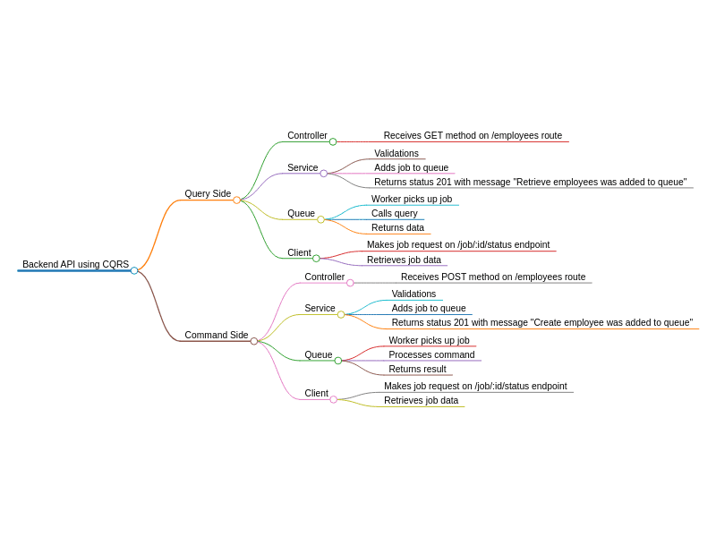

# Employee Management Dashboard

This is a simple employee management dashboard built with Next.js, Chakra UI, and a Node.js backend with Express and MongoDB. The dashboard allows users to manage a list of employees, including adding, editing, and deleting employee records. The project utilizes CQRS (Command Query Responsibility Segregation) architecture, BullMQ for job queuing, and Redis for efficient data caching and message brokering.

## Table of Contents
- [Features](#features)
- [Technologies Used](#technologies-used)
- [Architecture](#architecture)
- [Installation](#installation)
- [Running the Application](#running-the-application)
- [Project Structure](#project-structure)
- [API Endpoints](#api-endpoints)
- [Testing](#testing)
- [Future Enhancements](#future-enhancements)

## Features
- View a list of employees
- Add a new employee
- Edit an existing employee's details
- Delete an employee
- Efficiently manage background tasks using BullMQ and Redis
- Segregated command and query operations using CQRS
- User authentication and authorization

## Technologies Used
- **Frontend**: Next.js, React, Chakra UI
- **Backend**: Node.js, Express, TypeScript, BullMQ, Redis, MongoDB
- **Database**: MongoDB
- **Styling**: Chakra UI

## Architecture

The Employee Management Dashboard follows a modern architecture pattern incorporating CQRS, BullMQ, and Redis to ensure scalability, maintainability, and efficient handling of background jobs.

### CQRS (Command Query Responsibility Segregation)
CQRS separates the write (command) and read (query) operations of the system, providing a clear distinction between modifying data and retrieving data. This helps in scaling read and write operations independently and enhances the maintainability of the codebase.

### BullMQ
BullMQ is used for job queuing and processing. It handles background tasks like creating, updating, and deleting employee records, ensuring that these operations are performed asynchronously and efficiently.

### Redis
Redis is used as a message broker and caching layer. It improves the performance of the system by caching frequently accessed data and managing the job queue.

Here is an overview of the project's architecture:



## Installation

### Prerequisites
- Node.js (>= 14.x)
- npm or yarn
- MongoDB instance
- Redis instance

### Clone the Repository
```bash
git clone git@github.com:coutinhomarco/employee-dashboard.git
cd employee-management-dashboard
```

### Install Dependencies
```bash
# For both frontend and backend
npm install
# or
yarn install
```

## Running the Application

### Setup Environment Variables
Create a `.env` file in the `server` directory and a `.env.local` file in the `client` directory and add the following environment variables:

#### `.env` (Server)
```env
MONGODB_URI=mongodb://localhost:27017/your-db-name
REDIS_URL=127.0.0.1
REDIS_PORT=6379
JWT_SECRET=your_jwt_secret
```

#### `.env.local` (Client)
```env
NEXT_PUBLIC_API_BASE_URL=http://localhost:5000
```

### Start the Backend Server
```bash
cd server
npm run dev
# or
yarn dev
```

### Start the Frontend Server
```bash
cd client
npm run dev
# or
yarn dev
```

### Access the Application
Open your browser and go to `http://localhost:3000`.

## Project Structure

```plaintext
employee-management-dashboard/
├── client/
│   ├── public/
│   ├── src/
│   │   ├── components/
│   │   └── pages/
│   │       ├── _app.tsx
│   │       ├── add-employee.tsx
│   │       ├── edit-employee.tsx
│   │       └── index.tsx
│   ├── package.json
│   ├── tsconfig.json
│   └── .env.local
├── server/
│   ├── types/
│   ├── src/
│   │   ├── commands/
│   │   ├── controllers/
│   │   ├── middleware/
│   │   ├── models/
│   │   ├── queries/
│   │   ├── routes/
│   │   ├── services/ 
│   │   ├── utils/
│   │   │   ├── bullmq.ts
│   │   │   ├── validations/
│   │   │   └── intefaces/
│   │   └── index.ts
│   ├── tests/
│   ├── jest.config.js
│   ├── package.json
│   ├── tsconfig.json
│   └── .env
├── diagram.png
├── README.md
└── package.json
```

## API Endpoints

### Authentication Endpoints
- `POST /api/auth/register`: Register a new user
- `POST /api/auth/login`: Log in a user

### Employee Endpoints
- `GET /api/employees`: Retrieve all employees
- `GET /api/employees/:id`: Retrieve a single employee by ID
- `POST /api/employees`: Create a new employee
- `PUT /api/employees/:id`: Update an employee by ID
- `DELETE /api/employees/:id`: Delete an employee by ID

### Job Status Endpoints
- `GET /api/job/:id/status`: Retrieve the status of a job by job ID

Here are some request and response examples for the various API endpoints, which you can add to your README:

## API Endpoints

### Authentication Endpoints

#### Register a New User
- **Endpoint**: `POST /api/auth/register`
- **Request Body**:
    ```json
    {
        "username": "newuser",
        "password": "newpassword"
    }
    ```
- **Response**:
    ```json
    {
        "_id": "60b8c0b8c0b8c0b8c0b8c0b8",
        "username": "newuser",
        "token": "eyJhbGciOiJIUzI1NiIsInR5cCI6IkpXVCJ9..."
    }
    ```
- **Error Response** (if username already exists):
    ```json
    {
        "message": "Username already exists"
    }
    ```

#### Log In a User
- **Endpoint**: `POST /api/auth/login`
- **Request Body**:
    ```json
    {
        "username": "existinguser",
        "password": "existingpassword"
    }
    ```
- **Response**:
    ```json
    {
        "_id": "60b8c0b8c0b8c0b8c0b8c0b8",
        "username": "existinguser",
        "token": "eyJhbGciOiJIUzI1NiIsInR5cCI6IkpXVCJ9..."
    }
    ```
- **Error Response** (if credentials are invalid):
    ```json
    {
        "message": "Invalid credentials"
    }
    ```

### Employee Endpoints

#### Retrieve All Employees
- **Endpoint**: `GET /api/employees`
- **Response**:
    ```json
    [
        {
            "_id": "60b8c0b8c0b8c0b8c0b8c0b8",
            "name": "John Doe",
            "position": "Software Engineer",
            "department": "Engineering",
            "dateOfHire": "06/21/2020"
        },
        {
            "_id": "60b8c0b8c0b8c0b8c0b8c0b9",
            "name": "Jane Smith",
            "position": "Product Manager",
            "department": "Product",
            "dateOfHire": "06/21/2022"
        }
    ]
    ```

#### Retrieve a Single Employee by ID
- **Endpoint**: `GET /api/employees/:id`
- **Response**:
    ```json
    {
        "_id": "60b8c0b8c0b8c0b8c0b8c0b8",
        "name": "John Doe",
        "position": "Software Engineer",
        "department": "Engineering",
        "dateOfHire": "06/21/2022"
    }
    ```
- **Error Response** (if employee not found):
    ```json
    {
        "message": "Employee not found"
    }
    ```

#### Create a New Employee
- **Endpoint**: `POST /api/employees`
- **Request Body**:
    ```json
    {
        "name": "Alice Johnson",
        "position": "Designer",
        "department": "Design",
        "dateOfHire": "06/21/2022"
    }
    ```
- **Response**:
    ```json
    {
        "_id": "60b8c0b8c0b8c0b8c0b8c0ba",
        "name": "Alice Johnson",
        "position": "Designer",
        "department": "Design",
        "dateOfHire": "06/21/2022"
    }
    ```
- **Error Response** (if validation fails):
    ```json
    {
        "message": "Validation error",
        "errors": {
            "name": "Name is required",
            "position": "Position is required"
        }
    }
    ```

#### Update an Employee by ID
- **Endpoint**: `PUT /api/employees/:id`
- **Request Body**:
    ```json
    {
        "name": "Alice Johnson",
        "position": "Senior Designer",
        "department": "Design",
        "dateOfHire": "06/21/2022"
    }
    ```
- **Response**:
    ```json
    {
        "_id": "60b8c0b8c0b8c0b8c0b8c0ba",
        "name": "Alice Johnson",
        "position": "Senior Designer",
        "department": "Design",
        "dateOfHire": "06/21/2022"
    }
    ```
- **Error Response** (if employee not found):
    ```json
    {
        "message": "Employee not found"
    }
    ```

#### Delete an Employee by ID
- **Endpoint**: `DELETE /api/employees/:id`
- **Response**:
    ```json
    {
        "message": "Employee deleted"
    }
    ```
- **Error Response** (if employee not found):
    ```json
    {
        "message": "Employee not found"
    }
    ```

### Job Status Endpoints

#### Retrieve the Status of a Job by Job ID
- **Endpoint**: `GET /api/job/:id/status`
- **Response**:
    ```json
    {
        "jobId": "60b8c0b8c0b8c0b8c0b8c0bc",
        "status": "completed",
        "progress": 100,
        "result": {
            "success": true,
            "message": "Employee created successfully"
        }
    }
    ```
- **Error Response** (if job not found):
    ```json
    {
        "message": "Job not found"
    }
    ```

Feel free to include these examples in your README to help users understand how to interact with your API.


## Testing

### Running Tests
This project uses Jest for testing. To run the tests, use the following command:

```bash
cd server
npm test
# or
yarn test
```

## Future Enhancements
- Implement pagination for employee list
- Add more unit and integration tests
- Enhance error handling and validation
- Improve UI/UX for better user experience